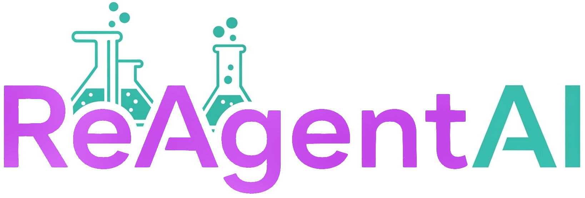

## Setup
Supported Python versions: 3.10 and 3.11.

Create a `.env` file in the root directory with the following content:
```env
GEMINI_API_KEY=your_gemini_api_key
```

#### setup with uv
```sh
uv run download_public_data data 
uv run run.py
```
Note: You need a trained model and a stock collection. You can download a publicly available model based on USPTO and a stock
collection from ZINC database using the following command `download_public_data data`.
#### setup with pip
```sh
python -m venv .venv --upgrade-deps &&
source .venv/bin/activate &&
pip install . &&
download_public_data data &&
python run.py
```

### Docker Setup
To run the application using Docker:

Download model based on USPTO and a stock collection from ZINC database:
```shell
uv run download_public_data data
```
Build the Docker image:
```sh
sudo docker build -t reagentai .
```
Run the Docker container:
```sh
sudo docker run -p 7860:7860 --env-file .env reagentai
```
Access the application in your browser at: http://127.0.0.1:7860/


### Troubleshooting
Problem:
```
ImportError: PATH_TO_PROJECT_DIRECTORY/.venv/lib/python3.10/site-packages/onnxruntime/capi/onnxruntime_pybind11_state.cpython-310-x86_64-linux-gnu.so: cannot enable executable stack as shared object requires: Invalid argument
```
Possible solution:
```
execstack -c PATH_TO_PROJECT_DIRECTORY/.venv/lib/python3.10/site-packages/onnxruntime/capi/onnxruntime_pybind11_state.cpython-310-x86_64-linux-gnu.so
```
